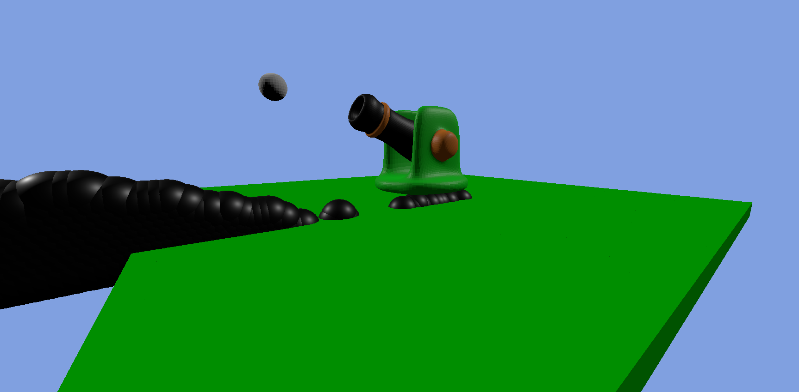

# 🎮 Darkzone Empire

A 3D browser-based game built with Three.js and physics using cannon-es.
This project is part of my journey learning game development and real-time rendering.



## Tech Stack

* JavaScript
* Three.js
* cannon-es.js
* Blender (for models)


## How to Run

1. Clone the repository:

```bash
git clone https://github.com/YOUR_USERNAME/darkzone-empire.git
```

2. Open the project folder

3. Run with a local server (important for models to load properly)

Example using VS Code Live Server:

* Install Live Server extension
* Right-click `index.html`
* Click **"Open with Live Server"**


## Future Plans

* Add enemies / AI
* Improve shooting mechanics
* Add sound effects
* UI (health, score, etc.)
* Better models and textures
* Different characters
* Add Multiplayer


## Author

Made by **DummyCode**
